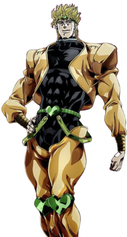

  <h2 align="center">Welcome to Community Battle game</h2>

Welcome to my Github profile! We're playing Battle game, you can join with us!

It's the <b><b> team's turn.

<table align="center">
  <thead align="center">
    <tr>
      <td><b>Jotaro Kujo</b></td>
      <td><b>Dio Brando</b></td>
    </tr>
  </thead>
  <tbody>
    <tr align="center">
      <td><code></code></td>
      <td><code></code></td>
    </tr>
    <tr>
      <td>HP: ███░░░░░░░ 33/100   MP: ██████ 25/25  Win: 1   Total Damage: 245   Total Heal: 56</td>
      <td>HP: ██░░░░░░░░ 24/100   MP: ██████ 25/25  Win: 2   Total Damage: 288   Total Heal: 40</td>
    </tr>
  </tbody>
</table>

    ---
    ----
    ---

<b><b> turn. You rolled a 4!

What would you like to do?

| Choices *(pick one of them!)*                                                                                                                                                                          |
|:--------------------------------------------------------------------------------------------------------------------------------------------------------------------------------------------------------|
| [Attack Jotaro Kujo with 4 points](https://github.com/congthanhng/congthanhng/issues/new?title=battle%7Cplay%7Cattack%7C4&body=Just+push+%27Submit+new+issue%27.+You+don%27t+need+to+do+anything+else.) |
| [Heal yourself with 4 points](https://github.com/congthanhng/congthanhng/issues/new?title=battle%7Cplay%7Cheal%7C4&body=Just+push+%27Submit+new+issue%27.+You+don%27t+need+to+do+anything+else.)           |
| [Using MP, Attack with x2 dame: 8 points](https://github.com/congthanhng/congthanhng/issues/new?title=battle%7Cplay%7Cattackx2%7C4&body=Just+push+%27Submit+new+issue%27.+You+don%27t+need+to+do+anything+else.)           |
| [Using MP, Heal with x2 value: 8 points](https://github.com/congthanhng/congthanhng/issues/new?title=battle%7Cplay%7Chealx2%7C4&body=Just+push+%27Submit+new+issue%27.+You+don%27t+need+to+do+anything+else.)           |

 

**:alarm_clock: Most recent moves**
| Team | Dices Roll | Action | Made by |
| ---- | :----: | ------- | ------- |
|  | 4 | attack | [@congthanhng](https://github.com/congthanhng) |
|  | 8 | attack | [@congthanhng](https://github.com/congthanhng) |

 

**🎮 Players check-in**

 

  

<b>How do I play?</b>

## Rules of the game

It's the  team versus the 
team.

The first team make the HP of opponent to 0 will be win.

Before you action, you must to roll 2 dices, the dices have 6 side: 1 -> 6.

The Dices will randomly roll and return you the result.

Base on the result of roll, you need to choice Attack or Heal.

If you choose Attack, the opponent will be decreased the HP correspond with the points dices rolled. The opponent also increase the MP point.

If you choose Heal, your character will be recovered the HP lost correspond with the total point of the dices. If you recover your heal over max HP, the remain HP will be increase the MP point.

When the MP is full, you can call Stand. If you call the Stand all your next action will be double value. After call the Stand, you MP is reset to 0.

## How to play

Playing Community Battle game on my GitHub profile is easy. The dice have already been rolled
for you &mdash; all you have to do is decide what to do with them. Anyone
with a GitHub account can play.

Anyone can join either team at any time, but once you're in a team, you're
locked into it until the game ends. You won't be able to play a move when
it's the other team's turn.

The list of links below the board image shows each possible move. Clicking
one of those will take you to a page where you can create an issue in this
repository, where all you have to do is click submit to play your move.

It will take a moment for Github Actions to acknowledge your move, it'll also make a commit to record your move.

## Behind the scenes

Check out the [`source` branch of this repository](https://github.com/congthanhng/congthanhng) for the source
code and a little commentary on the inspiration behind this project.

### Contributing

I welcome bug reports, feature suggestions and pull requests! Just make
sure you ping me in your issue or PR by adding `cc @congthanhng`, as I don't receive notifications for new issues in this repository
(for hopefully obvious reasons).

  <h2 align="center">About me </h2>

 I’m Cong Nguyen

 I’m currently working on Mobile Development with Flutter

 I’m currently learning, improving and contributing around Flutter framework

 I’m looking to collaborate on any kind of project

 I’m looking for help with backend knowledge

 Ask me about any things relative to Flutter and mobile development

 Fun fact: I'm looking for a new job

<h3 align="center"> Languages, Frameworks and Tools </h3>

<code></code>
<code></code>
<code></code>
<code></code>
<code></code>
<code></code>
<code></code>
<code></code>
<code></code>
<code></code>
<code></code>
<code></code>
<code></code>
<code></code>
<code></code>
<code></code>
<code></code>
<code></code>

<h3 align="center"> Open source projects
 </h3>
<table align="center">
  <thead align="center">
    <tr>
      <td><b>🎁 Projects</b></td>
      <td><b>👍 Likes</b></td>
      <td><b>💯 Points</b></td>
      <td><b>🌐 Popularity</b></td>
    </tr>
  </thead>
  <tbody>
    <tr>
      <td><a href="https://github.com/congthanhng/Expansion-Tile-Group"><b>Flutter Expansion-Tile-Group Widget</b></a></td>
      <td></td>
      <td></td>
      <td></td>
    </tr>
  </tbody>
</table>
 

&nbsp;
  
  

<code></code>

<h3 align="center">Connect with me</h3>

  

<h3 align="center">Support</h3>

  
  

<!--   -->

    
  